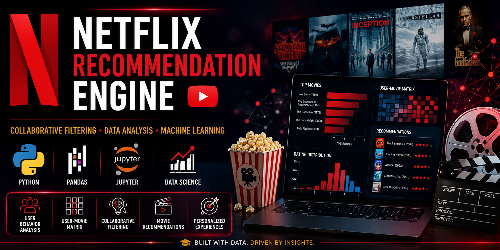
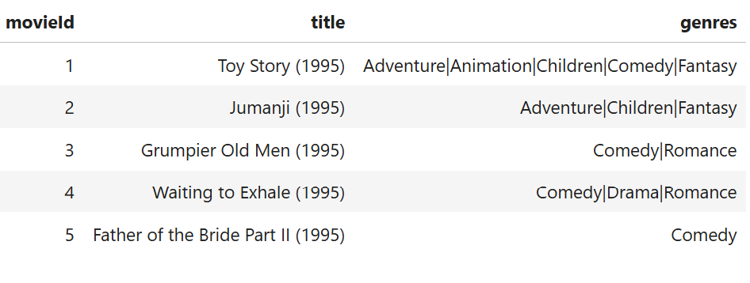
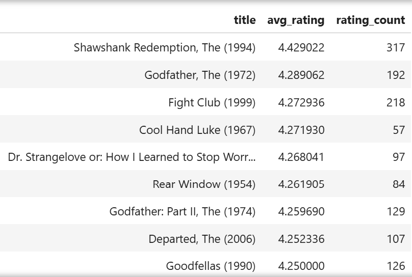
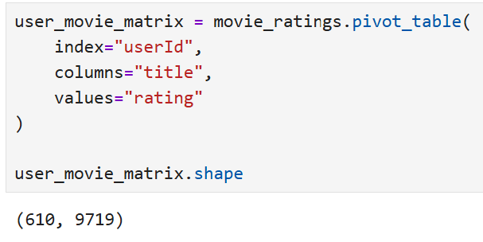
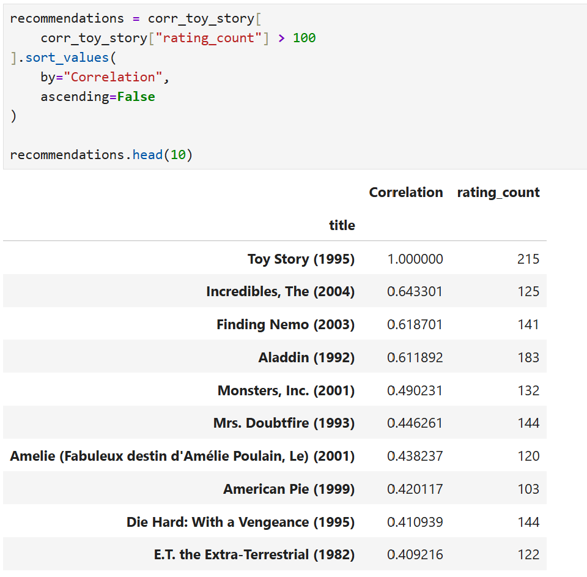

# Netflix Recommendation Engine



A recommendation engine built using collaborative filtering techniques and the MovieLens dataset to simulate how streaming platforms personalize content recommendations based on user behavior and rating patterns.

## Project Highlights

* Processed 100,836 movie ratings
* Analyzed 9,742 movies across 610 users
* Built a 610 × 9,719 user-movie interaction matrix
* Implemented collaborative filtering recommendations
* Generated movie recommendations based on user behavior patterns
* Demonstrated recommendation system concepts used by platforms such as Netflix, Amazon, Spotify, and YouTube

---

## Project Overview

Recommendation systems are one of the most widely used machine learning applications in modern technology. Streaming platforms rely on recommendation engines to personalize content, increase user engagement, and improve customer retention.

This project simulates a Netflix-style recommendation engine by analyzing historical user ratings and identifying patterns between similar movies.

The project includes:

* Data ingestion and preprocessing
* Exploratory data analysis
* Movie popularity analysis
* User-movie matrix construction
* Collaborative filtering recommendations
* Business insights and recommendation system applications

---

## Dataset

MovieLens Latest Small Dataset

| Metric            | Value       |
| ----------------- | ----------- |
| Movies            | 9,742       |
| Ratings           | 100,836     |
| Users             | 610         |
| User-Movie Matrix | 610 × 9,719 |

Dataset Source:

https://grouplens.org/datasets/movielens/

---

## Technologies Used

* Python
* Pandas
* NumPy
* Jupyter Notebook
* Git
* GitHub

---

## Skills Demonstrated

* Data Cleaning
* Data Wrangling
* Exploratory Data Analysis (EDA)
* Feature Engineering
* Recommendation Systems
* Collaborative Filtering
* Business Analytics
* Data Visualization
* Git Version Control
* GitHub Documentation

---

## Project Workflow

### 1. Data Collection

Loaded movie metadata and user ratings from the MovieLens dataset.

### 2. Data Preparation

Merged movie and rating datasets into a single analytical dataset.

### 3. Exploratory Data Analysis

Analyzed movie popularity, rating distributions, and user engagement trends.

### 4. User-Movie Matrix Construction

Created a user-movie interaction matrix containing:

* 610 users
* 9,719 movies

This matrix serves as the foundation for recommendation generation.

### 5. Collaborative Filtering

Calculated movie similarity using user rating correlations to identify movies with similar audience behavior patterns.

Example recommendations generated for **Toy Story (1995)**:

* The Incredibles (2004)
* Finding Nemo (2003)
* Aladdin (1992)
* Monsters, Inc. (2001)
* Mrs. Doubtfire (1993)

---

## Key Results

| Metric            | Value       |
| ----------------- | ----------- |
| Movies            | 9,742       |
| Ratings           | 100,836     |
| Users             | 610         |
| User-Movie Matrix | 610 × 9,719 |

---

## Key Findings

* Processed over 100,000 user ratings to create a recommendation-ready dataset.
* Built a scalable user-movie interaction matrix for recommendation generation.
* Identified relationships between movies based on user rating behavior.
* Successfully generated relevant movie recommendations using collaborative filtering techniques.
* Demonstrated how recommendation systems can identify related content without relying solely on movie genres or metadata.

---

## Project Screenshots

### Dataset Overview



### Top Rated Movies Analysis



### User-Movie Matrix



### Recommendation Results



---

## Business Value

Recommendation engines provide significant value to organizations by:

* Increasing user engagement
* Improving customer retention
* Personalizing user experiences
* Driving content discovery
* Increasing watch time and platform usage

Companies such as Netflix, Amazon, Spotify, Disney+, Hulu, and YouTube rely heavily on recommendation systems to improve customer satisfaction and maximize customer lifetime value.

---

## Future Enhancements

Planned improvements include:

* User-Based Collaborative Filtering
* Item-Based Collaborative Filtering
* Matrix Factorization
* Content-Based Recommendations
* Hybrid Recommendation Systems
* Recommendation API Development
* Interactive Recommendation Dashboard
* Web Application Deployment

---

## Repository Structure

```text
netflix-recommendation-engine/
│
├── data/
│   ├── movies.csv
│   └── ratings.csv
│
├── notebooks/
│   └── Netflix_Recommendation_Engine.ipynb
│
├── visuals/
│   ├── banner.png
│   ├── dataset_overview.png
│   ├── top_movies.png
│   ├── user_movie_matrix.png
│   └── recommendations.png
│
├── README.md
├── requirements.txt
└── .gitignore
```

---

## Author

Jeremie Merchant

Master of Science in Data Science

LinkedIn:
https://www.linkedin.com/in/jeremie-merchant

GitHub:
https://github.com/jmerch81

Seeking opportunities in:

* Data Analytics
* Business Intelligence
* Data Science
* Machine Learning
